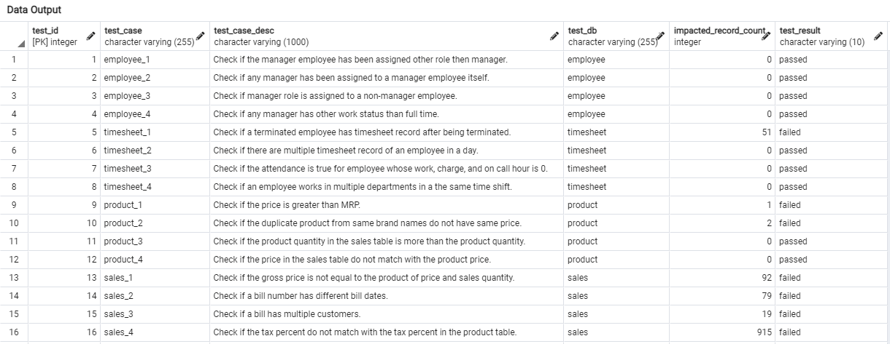

## Data Validation
### For employee table
#####  1.  Check if the manager employee has been assigned other role then manager.
~~~~ sql
SELECT
  COUNT(*) AS impacted_record_count,
  CASE
    WHEN COUNT(*) > 0 THEN 'failed'
    ELSE 'passed'
  END AS test_result
FROM (
  SELECT DISTINCT e.client_employee_id
  FROM employee e
  JOIN employee m
    ON e.client_employee_id = m.manager_employee_id
  WHERE e.role <> 'Manager'
) test_result;
~~~~
> Remarks: Test passed!
#####  2. Check if any manager has been assigned to a manager employee itself.
~~~~ sql
SELECT
  COUNT(*) AS impacted_record_count,
  CASE
    WHEN COUNT(*) > 0 THEN 'failed'
    ELSE 'passed'
  END AS test_result
FROM employee
WHERE role = 'Manager'
  AND manager_employee_id IS NOT NULL;
~~~~
> Remarks: Test passed!
#####  3.  Check if manager role is assigned to a non-manager employee. 
~~~~ sql
SELECT
  COUNT(*) AS impacted_record_count,
  CASE
    WHEN COUNT(*) > 0 THEN 'failed'
    ELSE 'passed'
  END AS test_result
FROM (
  SELECT DISTINCT client_employee_id FROM employee
  WHERE role = 'Manager'
  EXCEPT
  SELECT manager_employee_id FROM employee
) test_result;
~~~~
> Remarks: Test passed!
#####  4.  Check if any manager has other work status than full time.
~~~~ sql
SELECT
  COUNT(*) AS impacted_record_count,
  CASE
    WHEN COUNT(*) > 0 THEN 'failed'
    ELSE 'passed'
  END AS test_result
FROM employee
WHERE role = 'Manager'
  AND fte_status <> 'Full Time';
~~~~
> Remarks: Test passed!

### For timesheet table
#####  1. Check if a terminated employee has timesheet record after being terminated. 
~~~~ sql
SELECT
  COUNT(*) AS impacted_record_count,
  CASE
    WHEN COUNT(*) > 0 THEN 'failed'
    ELSE 'passed'
  END AS test_result
FROM (
  SELECT t.employee_id, e.term_date, shift_date
  FROM timesheet t
  JOIN employee e
    ON t.employee_id = e.client_employee_id
  WHERE e.is_active IS FALSE
    AND t.shift_date > e.term_date
) test_result;
~~~~
> Remarks: Test failed!
> 51 records found.
#####  2. Check if there are multiple timesheet record of an employee in a day. 
~~~~ sql
SELECT
  COUNT(*) AS impacted_record_count,
  CASE
    WHEN COUNT(*) > 0 THEN 'failed'
    ELSE 'passed'
  END AS test_result
FROM (
  SELECT employee_id, COUNT(employee_id), shift_date
  FROM timesheet
  GROUP BY employee_id, shift_date
  HAVING COUNT(employee_id) > 1
) test_result;
~~~~
> Remarks: Test passed!
#####  3.  Check if the attendance is true for employee whose work, charge, and on call hour is 0.
~~~~ sql
SELECT
  COUNT(*) AS impacted_record_count,
  CASE
    WHEN COUNT(*) > 0 THEN 'failed'
    ELSE 'passed'
  END AS test_result
FROM timesheet
WHERE attendance IS TRUE
  AND hours_worked = 0
  AND charge_hour = 0
  AND on_call_hour = 0;
~~~~
> Remarks: Test passed!
#####  4. Check if an employee works in multiple departments in the same time shift.
~~~~ sql
SELECT
  COUNT(*) AS impacted_record_count,
  CASE
    WHEN COUNT(*) > 0 THEN 'failed'
    ELSE 'passed'
  END AS test_result
FROM (
  SELECT employee_id
  FROM timesheet
  GROUP BY employee_id, shift_start_time, shift_end_time, shift_date
  HAVING COUNT(department_id) > 1
) test_result;
~~~~
> Remarks: Test passed!

### For product table
#####  1. Check if the price is greater than MRP.
~~~~ sql
SELECT
  COUNT(*) AS impacted_record_count,
  CASE
    WHEN COUNT(*) > 0 THEN 'failed'
    ELSE 'passed'
  END AS test_result
FROM product
WHERE price > mrp;
~~~~
> Remarks: Test failed!
> 1 record found.
#####  2. Check if the duplicate product from same brand names do not have same price.
~~~~ sql
SELECT
  COUNT(*) AS impacted_record_count,
  CASE
    WHEN COUNT(*) > 0 THEN 'failed'
    ELSE 'passed'
  END AS test_result
FROM (
  SELECT product_name, brand, COUNT(DISTINCT price) 
  FROM product
  GROUP BY product_name, brand
  HAVING COUNT(DISTINCT price) > 1
) test_result;
~~~~
> Remarks: Test failed!
> 2 records found. 
#####  3.  Check if the product quantity in the sales table is more than the product quantity. 
~~~~ sql
SELECT
  COUNT(*) AS impacted_record_count,
  CASE
    WHEN COUNT(*) > 0 THEN 'failed'
    ELSE 'passed'
  END AS test_result
FROM product p
JOIN sales s
  ON p.product_id = s.product_id
WHERE s.qty > p.pieces_per_case;
~~~~
> Remarks: Test passed!
#####  4.  Check if the price in the sales table do not match with the product price.
~~~~ sql
SELECT
  COUNT(*) AS impacted_record_count,
  CASE
    WHEN COUNT(*) > 0 THEN 'failed'
    ELSE 'passed'
  END AS test_result
FROM product p
JOIN sales s
  ON p.product_id = s.product_id
WHERE p.price <> s.price;
~~~~
> Remarks: Test passed!

### For sales table
#####  1.  Check if the gross price is not equal to the product of price and sales quantity.
~~~~ sql
SELECT
  COUNT(*) AS impacted_record_count,
  CASE
    WHEN COUNT(*) > 0 THEN 'failed'
    ELSE 'passed'
  END AS test_result
FROM sales
WHERE ROUND(gross_price::NUMERIC, 2) <> ROUND((qty * price)::NUMERIC, 2);
~~~~
> Remarks: Test failed!
> 92 records found!
#####  2.  Check if a bill number has different bill dates.
~~~~ sql
SELECT
  COUNT(*) AS impacted_record_count,
  CASE
    WHEN COUNT(*) > 0 THEN 'failed'
    ELSE 'passed'
  END AS test_result
FROM (
  SELECT bill_no, COUNT(DISTINCT bill_date)
  FROM sales
  GROUP BY bill_no
  HAVING COUNT(DISTINCT bill_date) > 1
) test_result;
~~~~
> Remarks: Test failed!
> 79 records found.
#####  3.  Check if a bill has multiple customers.
~~~~ sql
SELECT
  COUNT(*) AS impacted_record_count,
  CASE
    WHEN COUNT(*) > 0 THEN 'failed'
    ELSE 'passed'
  END AS test_result
FROM (
  SELECT bill_no, COUNT(DISTINCT customer_id)
  FROM sales
  GROUP BY bill_no
  HAVING COUNT(DISTINCT customer_id) > 1
) test_result;
~~~~
> Remarks: Test failed!
> 19 records found.
#####  4. Check if the tax percent do not match with the tax percent in the product table.
~~~~ sql
SELECT
  COUNT(*) AS impacted_record_count,
  CASE
    WHEN COUNT(*) > 0 THEN 'failed'
    ELSE 'passed'
  END AS test_result
FROM sales s
JOIN product p
  ON s.product_id = p.product_id
WHERE p.tax_percent <> s.tax_pc;
~~~~
> Remarks: Test failed!
> 915 records found.

### Test Results

